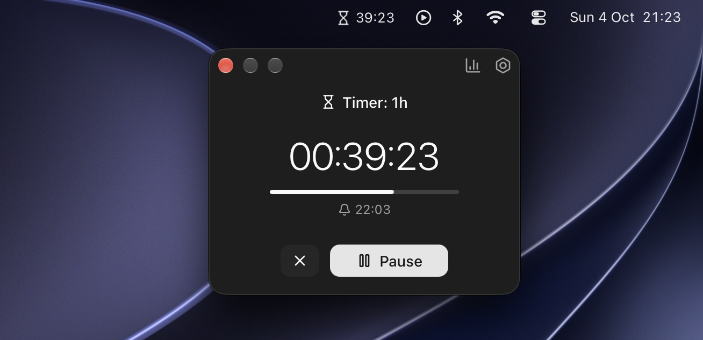

# Focus Time

A macOS menu bar app designed to help you stay focused and track your work. Includes a countdown timer, stopwatch, and Pomodoro mode.

Requires **macOS 26 (Tahoe)** or newer.



## Features

- Menu bar countdown timer, stopwatch, and Pomodoro.
- Light and dark mode.
- Timer state preserved across app restarts.
- Pause when your Mac sleeps.
- Stats for the day, week, and month.
- Add, edit, and delete focused-time entries.

## Installation instructions

1. Download the latest `.dmg` file from [Github Releases page](https://github.com/rbika/focus-time/releases).
2. Open and move the app into Applications folder.
3. Run the following command in the terminal to remove quarantine flag:
   ```shell
   xattr -cr /Applications/Focus\ Time.app
   ```

## Develop

```bash
npm install
cp .env.example .env
npm run tauri dev
```

Debug builds load `.env` / `.env.local` from the project root. `ALWAYS_ON_TOP=true` keeps the timer panel visible while you work; set it to `false` for normal hide-on-blur. Release builds ignore these files and never pin.
